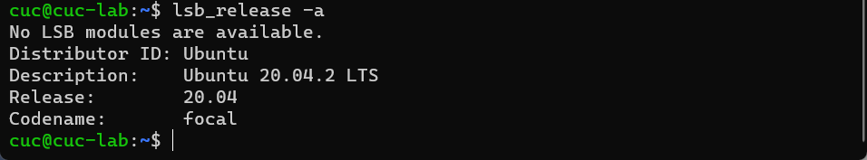
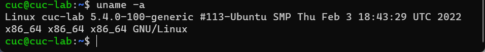
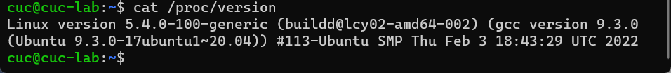
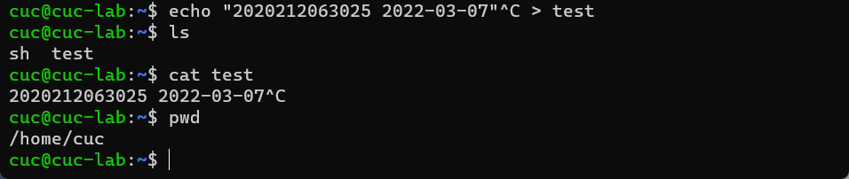
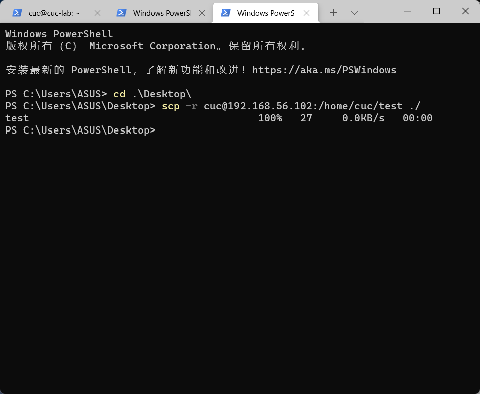
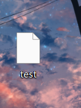
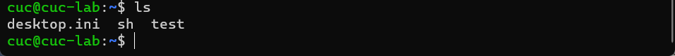
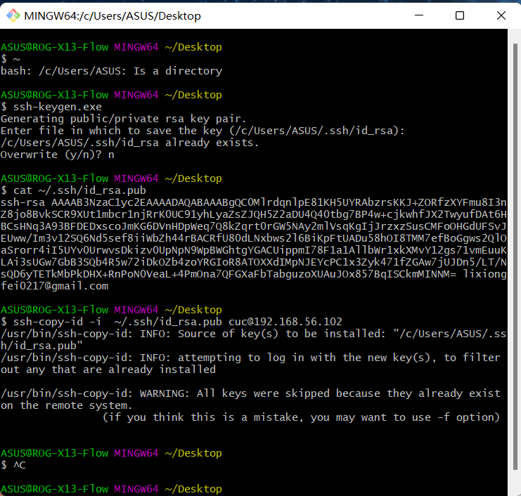
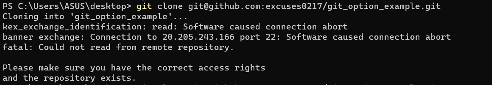

# 第一章：Linux基础（实验）

### 实验环境

- Ubuntu 20.04.2 LTS (在 VirtualBox 虚拟机中实现)
- Windows 11 pro （本机）

------

### 实验目标

- 调查并记录实验环境的如下信息：
  - 当前 Linux 发行版基本信息
  - 当前 Linux 内核版本信息
- Virtualbox 安装完 Ubuntu 之后新添加的网卡如何实现系统开机自动启用和自动获取 IP？
- 如何使用 `scp` 在「虚拟机和宿主机之间」、「本机和远程 Linux 系统之间」传输文件？
- 如何配置 SSH 免密登录？

------

### 实验过程

- **调查并记录实验环境的如下信息：**

  - 当前 Linux 发行版基本信息

    命令: lsb_release -a

    ```linux
    cuc@cuc-lab:~$ lsb_release -a
    No LSB modules are available.
    Distributor ID: Ubuntu
    Description:    Ubuntu 20.04.2 LTS
    Release:        20.04
    Codename:       focal
    ```
  
    
  
     命令: less /etc/os-release

    ```
    cuc@cuc-lab:~$ less /etc/os-release
    
    NAME="Ubuntu"
    VERSION="20.04.2 LTS (Focal Fossa)"
    ID=ubuntu
    ID_LIKE=debian
    PRETTY_NAME="Ubuntu 20.04.2 LTS"
    VERSION_ID="20.04"
    HOME_URL="https://www.ubuntu.com/"
    SUPPORT_URL="https://help.ubuntu.com/"
    BUG_REPORT_URL="https://bugs.launchpad.net/ubuntu/"
    PRIVACY_POLICY_URL="https://www.ubuntu.com/legal/terms-and-policies/privacy-policy"
    VERSION_CODENAME=focal
    UBUNTU_CODENAME=focal
    /etc/os-release (END)
    ```
  
    
  
  - 当前 Linux 内核版本信息
  
    命令: uname -a
  
    ```
    cuc@cuc-lab:~$ uname -a
    Linux cuc-lab 5.4.0-100-generic #113-Ubuntu SMP Thu Feb 3 18:43:29 UTC 2022 x86_64 x86_64 x86_64 GNU/Linux
    ```
    
    
    
    命令: cat /proc/version
  
    ```
    cuc@cuc-lab:~$ cat /proc/version
    Linux version 5.4.0-100-generic (buildd@lcy02-amd64-002) (gcc version 9.3.0 (Ubuntu 9.3.0-17ubuntu1~20.04)) #113-Ubuntu SMP Thu Feb 3 18:43:29 UTC 2022
    ```
    
    
  
- **Virtualbox 安装完 Ubuntu 之后新添加的网卡如何实现系统开机自动启用和自动获取 IP？**

  在 Virtualbox 中设置两块网卡，一块为<u>仅主机（Host-Only）网络</u>，<u>另一块为网络地址转换（NAT）</u>

  

  

  使用命令 ip a 可以查看网卡信息

  ```
  cuc@cuc-lab:~$ ip a
  1: lo: <LOOPBACK,UP,LOWER_UP> mtu 65536 qdisc noqueue state UNKNOWN group default qlen 1000
      link/loopback 00:00:00:00:00:00 brd 00:00:00:00:00:00
      inet 127.0.0.1/8 scope host lo
         valid_lft forever preferred_lft forever
      inet6 ::1/128 scope host
         valid_lft forever preferred_lft forever
  2: enp0s3: <BROADCAST,MULTICAST,UP,LOWER_UP> mtu 1500 qdisc fq_codel state UP group default qlen 1000
      link/ether 08:00:27:bd:4a:29 brd ff:ff:ff:ff:ff:ff
      inet 192.168.56.1**/24 brd 192.168.56.255 scope global dynamic enp0s3
         valid_lft 463sec preferred_lft 463sec
      inet6 fe80::a00:27ff:febd:4a29/64 scope link
         valid_lft forever preferred_lft forever
  3: enp0s8: <BROADCAST,MULTICAST,UP,LOWER_UP> mtu 1500 qdisc fq_codel state UP group default qlen 1000
      link/ether 08:00:27:d5:6c:8e brd ff:ff:ff:ff:ff:ff
      inet 10.0.3.15/24 brd 10.0.3.255 scope global dynamic enp0s8
         valid_lft 83563sec preferred_lft 83563sec
      inet6 fe80::a00:27ff:fed5:6c8e/64 scope link
         valid_lft forever preferred_lft forever
  ```
  
- **如何使用 `scp` 在「虚拟机和宿主机之间」、「本机和远程 Linux 系统之间」传输文件？**

  先在 Linux 系统中创建一个文件，并确定文件位置

  ```
  cuc@cuc-lab:~$ echo "2020212063025 2022-03-07"^C > test
  cuc@cuc-lab:~$ ls
  sh  test
  cuc@cuc-lab:~$ cat test
  2020212063025 2022-03-07^C
  cuc@cuc-lab:~$ pwd
  /home/cuc
  ```

  

  在 Windows 中远程将 Linux 的文件复制在本机中

  ```
  Windows PowerShell
  版权所有（C） Microsoft Corporation。保留所有权利。
  
  安装最新的 PowerShell，了解新功能和改进！https://aka.ms/PSWindows
  
  PS C:\Users\ASUS> cd .\Desktop\
  PS C:\Users\ASUS\Desktop> scp -r cuc@192.168.56.102:/home/cuc/test ./
  test                                      100%   27     0.0KB/s   00:00
  PS C:\Users\ASUS\Desktop>
  ```

  

  可以看到桌面已经有了复制过来的文件

  

  同理可以将 Windows 上的文件复制到 Linux 上

  ```
  PS C:\Users\ASUS\Desktop> scp desktop.ini cuc@192.168.56.102:/home/cuc/
  desktop.ini                               100%  282   281.9KB/s   00:00
  ```

  在 Linux 中查看

  ```
  cuc@cuc-lab:~$ ls
  desktop.ini  sh  test
  ```

  

- **如何配置 SSH 免密登录？**

  现在git bash中使用命令 ssh-keygen.exe

  ```
  ASUS@ROG-X13-Flow MINGW64 ~/Desktop
  $ ssh-keygen.exe
  Generating public/private rsa key pair.
  Enter file in which to save the key (/c/Users/ASUS/.ssh/id_rsa):
  /c/Users/ASUS/.ssh/id_rsa already exists.
  Overwrite (y/n)?
  
  #这里我已经生成过SSH密钥，所以不再配置
  ```

  使用命令  cat ~/.ssh/id_rsa.pub 查看密钥

  ```
  ASUS@ROG-X13-Flow MINGW64 ~/Desktop
  $ cat ~/.ssh/id_rsa.pub
  ssh-rsa AAAAB3NzaC1yc2EAAAADAQABAAABgQC0MlrdqnlpE81KH5UYRAbzrsKKJ+ZORfzXYFmu8I3nZ8jo8BvkSCR9XUt1mbcr1njRrK0UC91yhLyaZsZJQH5Z2aDU4Q40tbg7BP4w+cjkwhfJX2TwyufDAt6HBCsHNq3A93BFDEDxscoJmKG6DVnHDpWeq7Q8kZqrt0rGW5NAy2mlVsqKgIjJrzxzSusCMFoOHGdUFSvJEUww/Im3v12SQ6Nd5sef8iiWbZh44rBACRfU80dLNxbws2l6BiKpFtUADu58hOI8TMM7efBoGgws2QlOaSrorr4iI5UYv0UrwvsDkizv0UpNpN9WpBWGhtgYGACUippmI78F1a1AllbWr1xkXMvY12gs71vmEuuKLAi3sUGw7GbB3SQb4R5w72iDkOZb4zoYRGIoR8ATOXXdIMpNJEYcPC1x3Zyk471fZGAw7jUJDn5/LT/NsQD6yTETkMbPkDHX+RnPoN0VeaL+4PmOna7QFGXaFbTabguzoXUAuJOx857BqISCkmMINNM= lixiongfei0217@gmail.com
  ```

  使用命令  ssh-copy-id -i  ~/.ssh/id_rsa.pub cuc@192.168.56.1** 配置免密登录

  ```
  ASUS@ROG-X13-Flow MINGW64 ~/Desktop
  $ ssh-copy-id -i  ~/.ssh/id_rsa.pub cuc@192.168.56.102
  /usr/bin/ssh-copy-id: INFO: Source of key(s) to be installed: "/c/Users/ASUS/.ssh/id_rsa.pub"
  /usr/bin/ssh-copy-id: INFO: attempting to log in with the new key(s), to filter out any that are already installed
  
  /usr/bin/ssh-copy-id: WARNING: All keys were skipped because they already exist on the remote system.
                  (if you think this is a mistake, you may want to use -f option)
  
  #这里我已配置完毕，所以显示已经安装
  ```

  

  另外，还可以在 Windows 自带命令行( CMD 或 Windows PowerShell )中通过 scp 命令的方法建立远程SSH链接

  ```
  Windows PowerShell
  版权所有（C） Microsoft Corporation。保留所有权利。
  
  安装最新的 PowerShell，了解新功能和改进！https://aka.ms/PSWindows
  
  PS C:\Users\ASUS> ssh-keygen
  Generating public/private rsa key pair.
  Enter file in which to save the key (C:\Users\ASUS/.ssh/id_rsa):
  Enter passphrase (empty for no passphrase):
  Enter same passphrase again:
  Your identification has been saved in C:\Users\ASUS/.ssh/id_rsa.
  Your public key has been saved in C:\Users\ASUS/.ssh/id_rsa.pub.
  The key fingerprint is:
  SHA256:GxfoWrnw/7iPr3kS5wprtzBSpwatVQrmfwqKthmjHS0 asus@ROG-X13-Flow
  The key's randomart image is:
  +---[RSA 3072]----+
  |                 |
  |         .       |
  |      o . o      |
  |     o + + .     |
  |      + S o      |
  |   .   @ B. .    |
  |  E . = @ .+     |
  | o.B . +.Oo+o    |
  |..=..  .o.X@+    |
  +----[SHA256]-----+
  PS C:\Users\ASUS> scp C:\Users\ASUS\.ssh\id_rsa.pub cuc@192.168.56.102:/home/cuc/.ssh/authorized_keys
  cuc@192.168.56.102's password:
  id_rsa.pub                                                                            100%  572   286.9KB/s   00:00
  PS C:\Users\ASUS> ssh cuc@192.168.56.102
  Welcome to Ubuntu 20.04.2 LTS (GNU/Linux 5.4.0-100-generic x86_64)
  
   * Documentation:  https://help.ubuntu.com
   * Management:     https://landscape.canonical.com
   * Support:        https://ubuntu.com/advantage
  
    System information as of Mon 07 Mar 2022 03:25:23 PM UTC
  
    System load:  0.0                Processes:               109
    Usage of /:   12.8% of 38.63GB   Users logged in:         1
    Memory usage: 19%                IPv4 address for enp0s3: 192.168.56.102
    Swap usage:   0%                 IPv4 address for enp0s8: 10.0.3.15
  
   * Super-optimized for small spaces - read how we shrank the memory
     footprint of MicroK8s to make it the smallest full K8s around.
  
     https://ubuntu.com/blog/microk8s-memory-optimisation
  
  109 updates can be installed immediately.
  1 of these updates is a security update.
  To see these additional updates run: apt list --upgradable
  
  
  Last login: Mon Mar  7 14:56:02 2022 from 192.168.56.1
  cuc@cuc-lab:~$ exit
  logout
  Connection to 192.168.56.102 closed.
  PS C:\Users\ASUS>
  
  此方法参考视频链接：https://www.youtube.com/watch?v=gce7niSU82E
  ```

------


### 遇到的问题及解决方法

- **配置SSH免密登录时无法使用 ssh-copy-id 命令**

  **解决：**参考视频链接：https://www.youtube.com/watch?v=gce7niSU82E 绕开使用 ssh-copy-id 命令，但后来经老师提醒在 Windows 上需要在 git bash 上使用 ssh-copy-id 命令。由于我的系统是新装的，没有 git ，经过再次下载安装配置后成功再次使用 ssh-copy-id 命令配置SSH免密登录

- **git clone 远程仓库到本地时出现问题**

  

  **解决：**参考 https://www.bilibili.com/video/BV1Hb4y1R7FE?p=33&share_medium=iphone&share_plat=ios&share_session_id=3FE8CA05-B24D-4C4F-A64A-777DF0C19747&share_source=WEIXIN&share_tag=s_i&timestamp=1646740533&unique_k=MkrpjqS 配置网络设置即可正常 clone 仓库到本地

- git push 到 GitHub 仓库后图片无法正常渲染

  **解决：**

  - 要使用相对路径，需要在 markdown 文档同目录下建一个专门用来放图片的文件夹，通过相对路径引用图片
  - 注意要使用 ‘ / ’ 符号来写路径，而不是 Windows 系统中的 ‘ \’ 来写路径，不然上传到 GitHub 上后无法识别图片路径
  - 图片名中不能带有空格，不然也无法识别

