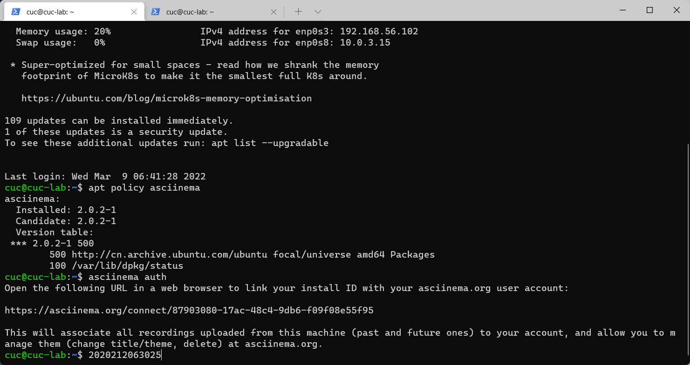

# 第二章：Linux服务器系统使用基础（实验）

### 实验环境

- Ubuntu 20.04.2 LTS（VirtualBox 虚拟机）
- CentOS Linux release 7.7.1908 (Core)（阿里云在线实验）
- asciinema 录屏

------

### 实验问题

- 使用表格方式记录至少 2 个不同 Linux 发行版本上以下信息的获取方法，使用 [asciinema](https://asciinema.org/) 录屏方式「分段」记录相关信息的获取过程和结果

- 【软件包管理】在目标发行版上安装 `tmux` 和 `tshark` ；查看这 2 个软件被安装到哪些路径；卸载 `tshark` ；验证 `tshark` 卸载结果

- 【文件管理】复制以下`shell`代码到终端运行，在目标 Linux 发行版系统中构造测试数据集，然后回答以下问题：

  - 找到 `/tmp` 目录及其所有子目录下，文件名包含 `666` 的所有文件
  - 找到 `/tmp` 目录及其所有子目录下，文件内容包含 `666` 的所有文件

  ```
  cd /tmp && for i in $(seq 0 1024);do dir="test-$RANDOM";mkdir "$dir";echo "$RANDOM" > "$dir/$dir-$RANDOM";done
  ```

- 【文件压缩与解压缩】练习课件中文件压缩与解压缩一节所有提到的压缩与解压缩命令的使用方法

- 【跟练】 子进程管理实验

- 【硬件信息获取】目标系统的 CPU、内存大小、硬盘数量与硬盘容量

------

### 实验过程

- asciinema 的安装

  1. 在 Ubuntu 系统上安装 asciinema 

     ```
     sudo apt install asciinema
     ```

  2. 用`apt policy asciinema`查看安装信息，使用命令`asciinema auth`生成一个链接，在浏览器打开，完成与账号的关联

     
     
  3. 分段记录实验过程

------

### 实验结果

|                  |                      Ubuntu 20.04.2 LTS                      |             CentOS Linux release 7.7.1908 (Core)             |
| :--------------: | :----------------------------------------------------------: | :----------------------------------------------------------: |
|    软件包管理    | [](https://asciinema.org/a/477178) | [](https://asciinema.org/a/475559) |
|     文件管理     | [](https://asciinema.org/a/477181) | [](https://asciinema.org/a/475548) |
| 文件压缩与解压缩 | [](https://asciinema.org/a/477208) | [](https://asciinema.org/a/475651) |
|  子进程管理实验  | [](https://asciinema.org/a/477304) | [](https://asciinema.org/a/475683) |
|   硬件信息获取   | [](https://asciinema.org/a/477212) | [](https://asciinema.org/a/477163) |

------

### 实验遇到的问题及解决方法

1. 在阿里云在线实验时发现无法用在本地用 ssh 登录，尝试多种方法都不行。最后只能在阿里云的 web 终端直接操作录屏。在完成实验后发现可能与选择阿里云的实验类型和平台有关系。
2. 在 CentOS 中的命令类型与 Ubuntu 中有所不同，比如安装软件等 CentOS 中使用的是 yum 命令，而 Ubuntu 使用的是 apt 相关的命令。而且在 CentOS 中是直接用 root 用户登录的，操作时不需要提升用户权限，在 Ubuntu 中使用的是 cuc 账户登录，需要使用 sudo 提升权限。
3. 在【文件管理】实验中发现查询出来的文件出现乱码，但由于我在用 asciinema 录制之前预演了一遍操作，我知道了这些乱码都是 asciinema 录制时的临时文件存储到 /tmp/ 目录下，对实际操作无影响。可以通过更改目录解决问题。

------

### 参考链接

1. CentOS 命令官方帮助 https://centoshelp.org/resources/commands/linux-system-commands/
2. CentOS、Ubuntu、Debian三个linux比较异同 https://zhuanlan.zhihu.com/p/32274264
