# 第三章：Linux服务器系统管理基础（实验）

## 实验环境

- Ubuntu 20.04.2 LTS（VirtualBox 虚拟机）
- Windows 11 (本机)
- asciinema 录屏

------

## 实验问题

- 动手实战 Systemd

  - [Systemd 入门教程：命令篇 by 阮一峰的网络日志](http://www.ruanyifeng.com/blog/2016/03/systemd-tutorial-commands.html)
  - [Systemd 入门教程：实战篇 by 阮一峰的网络日志](http://www.ruanyifeng.com/blog/2016/03/systemd-tutorial-part-two.html)
    - 参照第2章作业的要求，完整实验操作过程通过[asciinema](https://asciinema.org/)进行录像并上传，文档通过github上传

- 本章完成后的自查清单
  - 如何添加一个用户并使其具备 sudo 执行程序的权限？
  - 如何将一个用户添加到一个用户组？
  - 如何查看当前系统的分区表和文件系统详细信息？
  - 如何实现开机自动挂载Virtualbox的共享目录分区？
  - 基于LVM（逻辑分卷管理）的分区如何实现动态扩容和缩减容量？
  - 如何通过 systemd 设置实现在网络连通时运行一个指定脚本，在网络断开时运行另一个脚本？
  - 如何通过 systemd 设置实现一个脚本在任何情况下被杀死之后会立即重新启动？实现**杀不死**？

------

## 实验过程及结果

### 一、动手实战 Systemd（命令篇）

#### 1.由来

##### 1.1 启动服务

历史上，[Linux 的启动](https://www.ruanyifeng.com/blog/2013/08/linux_boot_process.html)一直采用[`init`](https://en.wikipedia.org/wiki/Init)进程。

下面的命令用来启动服务。

```bash
$ sudo /etc/init.d/apache2 start
# 或者
$ service apache2 start
```

这种方法有两个缺点。

一是启动时间长。`init`进程是串行启动，只有前一个进程启动完，才会启动下一个进程。

二是启动脚本复杂。`init`进程只是执行启动脚本，不管其他事情。脚本需要自己处理各种情况，这往往使得脚本变得很长。

#### 2.Systemd 概述

##### 2.1 查看Systemd版本

```bash
$ systemctl --version
```

上面的命令查看 Systemd 的版本。

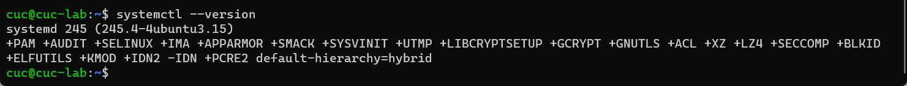

#### 3.系统管理

Systemd 并不是一个命令，而是一组命令，涉及到系统管理的方方面面。

##### 3.1 systemctl

`systemctl`是 Systemd 的主命令，用于管理系统。

```bash
# 重启系统
$ sudo systemctl reboot

# 关闭系统，切断电源
$ sudo systemctl poweroff

# CPU停止工作
$ sudo systemctl halt

# 暂停系统
$ sudo systemctl suspend

# 让系统进入冬眠状态
$ sudo systemctl hibernate

# 让系统进入交互式休眠状态
$ sudo systemctl hybrid-sleep

# 启动进入救援状态（单用户状态）
$ sudo systemctl rescue
```

- 除`sudo systemctl rescue`，其他情况执行后都会关机。
- 执行`sudo systemctl rescue`后，`Ctrl+D`后再次输入用户名和口令来登陆系统
- 由于要关闭系统所以无法使用 asciinema 录屏操作

##### 3.2 systemd-analyze

`systemd-analyze`命令用于查看启动耗时。

```bash
# 查看启动耗时
$ systemd-analyze                                                                                       

# 查看每个服务的启动耗时
$ systemd-analyze blame

# 显示瀑布状的启动过程流
$ systemd-analyze critical-chain

# 显示指定服务的启动流
$ systemd-analyze critical-chain atd.service
```

##### 3.3 hostnamectl

`hostnamectl`命令用于查看当前主机的信息。

```bash
# 显示当前主机的信息
$ hostnamectl

# 设置主机名。
$ sudo hostnamectl set-hostname rhel7
```

##### 3.4 localectl

`localectl`命令用于查看本地化设置。

```bash
# 查看本地化设置
$ localectl

# 设置本地化参数。
$ sudo localectl set-locale LANG=en_GB.utf8
$ sudo localectl set-keymap en_GB
```

##### 3.5 timedatectl

`timedatectl`命令用于查看当前时区设置。

```bash
# 查看当前时区设置
$ timedatectl

# 显示所有可用的时区
$ timedatectl list-timezones                                                                                   

# 设置当前时区
$ sudo timedatectl set-timezone America/New_York
$ sudo timedatectl set-time YYYY-MM-DD
$ sudo timedatectl set-time HH:MM:SS
```

##### 3.6 loginctl

`loginctl`命令用于查看当前登录的用户。

```bash
# 列出当前session
$ loginctl list-sessions

# 列出当前登录用户
$ loginctl list-users

# 列出显示指定用户的信息
$ loginctl show-user ruanyf
```

#### 实验：Systemd（命令篇）3.系统管理 (3.2-3.6)

[](https://asciinema.org/a/484401)

#### 4.Unit

##### 4.1 含义

`systemctl list-units`命令可以查看当前系统的所有 Unit 。

```bash
# 列出正在运行的 Unit
$ systemctl list-units

# 列出所有Unit，包括没有找到配置文件的或者启动失败的
$ systemctl list-units --all

# 列出所有没有运行的 Unit
$ systemctl list-units --all --state=inactive

# 列出所有加载失败的 Unit
$ systemctl list-units --failed

# 列出所有正在运行的、类型为 service 的 Unit
$ systemctl list-units --type=service
```

##### 4.2 Unit 的状态

`systemctl status`命令用于查看系统状态和单个 Unit 的状态。

```bash
# 显示系统状态
$ systemctl status

# 显示单个 Unit 的状态
$ sysystemctl status bluetooth.service

# 显示远程主机的某个 Unit 的状态
$ systemctl -H root@rhel7.example.com status httpd.service
```

除了`status`命令，`systemctl`还提供了三个查询状态的简单方法，主要供脚本内部的判断语句使用。

```bash
# 显示某个 Unit 是否正在运行
$ systemctl is-active application.service

# 显示某个 Unit 是否处于启动失败状态
$ systemctl is-failed application.service

# 显示某个 Unit 服务是否建立了启动链接
$ systemctl is-enabled application.service
```

##### 4.3 Unit 管理

对于用户来说，最常用的是下面这些命令，用于启动和停止 Unit（主要是 service）。

```bash
# 立即启动一个服务
$ sudo systemctl start apache2.service

# 立即停止一个服务
$ sudo systemctl stop apache2.service

# 重启一个服务
$ sudo systemctl restart apache2.service

# 杀死一个服务的所有子进程
$ sudo systemctl kill apache2.service

# 重新加载一个服务的配置文件
$ sudo systemctl reload apache2.service

# 重载所有修改过的配置文件
$ sudo systemctl daemon-reload

# 显示某个 Unit 的所有底层参数
$ systemctl show httpd.service

# 显示某个 Unit 的指定属性的值
$ systemctl show -p CPUShares httpd.service

# 设置某个 Unit 的指定属性
$ sudo systemctl set-property httpd.service CPUShares=500
```

##### 4.4 依赖关系

`systemctl list-dependencies`命令列出一个 Unit 的所有依赖。

```bash
$ systemctl list-dependencies nginx.service
```

上面命令的输出结果之中，有些依赖是 Target 类型（详见下文），默认不会展开显示。如果要展开 Target，就需要使用`--all`参数。

```bash
$ systemctl list-dependencies --all nginx.service
```

#### 实验：Systemd（命令篇） 4.Unit（4.1-4.4）

[](https://asciinema.org/a/484407)

#### 5.Unit 的配置文件

##### 5.1 概述

每一个 Unit 都有一个配置文件，告诉 Systemd 怎么启动这个 Unit 。

Systemd 默认从目录`/etc/systemd/system/`读取配置文件。但是，里面存放的大部分文件都是符号链接，指向目录`/usr/lib/systemd/system/`，真正的配置文件存放在那个目录。

`systemctl enable`命令用于在上面两个目录之间，建立符号链接关系。

```bash
$ sudo systemctl enable apache2.service
# 等同于
$ sudo ln -s '/usr/lib/systemd/system/clamd@scan.service' '/etc/systemd/system/multi-user.target.wants/clamd@scan.service'
```

如果配置文件里面设置了开机启动，`systemctl enable`命令相当于激活开机启动。

与之对应的，`systemctl disable`命令用于在两个目录之间，撤销符号链接关系，相当于撤销开机启动。

```bash
$ sudo systemctl disable clamd@scan.service
```

配置文件的后缀名，就是该 Unit 的种类，比如`sshd.socket`。如果省略，Systemd 默认后缀名为`.service`，所以`sshd`会被理解成`sshd.service`。

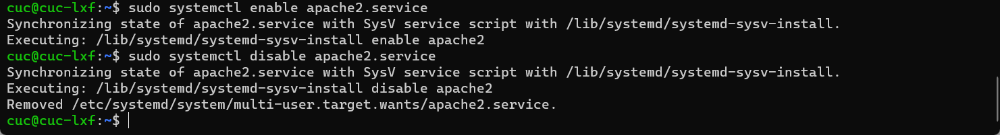

##### 5.2 配置文件的状态

`systemctl list-unit-files`命令用于列出所有配置文件。

```bash
# 列出所有配置文件
$ systemctl list-unit-files

# 列出指定类型的配置文件
$ systemctl list-unit-files --type=service
```

这个命令会输出一个列表。

```bash
$ systemctl list-unit-files

UNIT FILE              STATE
chronyd.service        enabled
clamd@.service         static
clamd@scan.service     disabled
```

这个列表显示每个配置文件的状态，一共有四种。

> - enabled：已建立启动链接
> - disabled：没建立启动链接
> - static：该配置文件没有`[Install]`部分（无法执行），只能作为其他配置文件的依赖
> - masked：该配置文件被禁止建立启动链接

注意，从配置文件的状态无法看出，该 Unit 是否正在运行。这必须执行前面提到的`systemctl status`命令。

```bash
$ systemctl status bluetooth.service
```

一旦修改配置文件，就要让 SystemD 重新加载配置文件，然后重新启动，否则修改不会生效。

```bash
$ sudo systemctl daemon-reload
$ sudo systemctl restart httpd.service
```

##### 5.3 配置文件的格式

配置文件就是普通的文本文件，可以用文本编辑器打开。

`systemctl cat`命令可以查看配置文件的内容。

```bash
$ systemctl cat atd.service
```

##### 5.4 配置文件的区块

`[Unit]`区块通常是配置文件的第一个区块，用来定义 Unit 的元数据，以及配置与其他 Unit 的关系。

Unit 配置文件的完整字段清单，请参考[官方文档](https://www.freedesktop.org/software/systemd/man/systemd.unit.html)。

#### 实验：Systemd（命令篇） 5.Unit 的配置文件（5.1-5.3）

[](https://asciinema.org/a/484411)

#### 6.Target

启动计算机的时候，需要启动大量的 Unit。如果每一次启动，都要一一写明本次启动需要哪些 Unit，显然非常不方便。Systemd 的解决方案就是 Target。

简单说，Target 就是一个 Unit 组，包含许多相关的 Unit 。启动某个 Target 的时候，Systemd 就会启动里面所有的 Unit。从这个意义上说，Target 这个概念类似于"状态点"，启动某个 Target 就好比启动到某种状态。

传统的`init`启动模式里面，有 RunLevel 的概念，跟 Target 的作用很类似。不同的是，RunLevel 是互斥的，不可能多个 RunLevel 同时启动，但是多个 Target 可以同时启动。

```bash
# 查看当前系统的所有 Target
$ systemctl list-unit-files --type=target

# 查看一个 Target 包含的所有 Unit
$ systemctl list-dependencies multi-user.target

# 查看启动时的默认 Target
$ systemctl get-default

# 设置启动时的默认 Target
$ sudo systemctl set-default multi-user.target

# 切换 Target 时，默认不关闭前一个 Target 启动的进程，
# systemctl isolate 命令改变这种行为，
# 关闭前一个 Target 里面所有不属于后一个 Target 的进程
$ sudo systemctl isolate multi-user.target
```

#### 实验：Systemd（命令篇） 6.Target

[](https://asciinema.org/a/484412)

#### 7.日志管理

Systemd 统一管理所有 Unit 的启动日志。带来的好处就是，可以只用`journalctl`一个命令，查看所有日志（内核日志和应用日志）。日志的配置文件是`/etc/systemd/journald.conf`。

`journalctl`功能强大，用法非常多。

```bash
# 查看所有日志（默认情况下 ，只保存本次启动的日志）
$ sudo journalctl

# 查看内核日志（不显示应用日志）
$ sudo journalctl -k

# 查看系统本次启动的日志
$ sudo journalctl -b
$ sudo journalctl -b -0

# 查看上一次启动的日志（需更改设置）
$ sudo journalctl -b -1

# 查看指定时间的日志
$ sudo journalctl --since="2022-4-5"
$ sudo journalctl --since "20 min ago"
$ sudo journalctl --since yesterday
$ sudo journalctl --since "2015-01-10" --until "2015-01-11 03:00"
$ sudo journalctl --since 09:00 --until "1 hour ago"

# 显示尾部的最新10行日志
$ sudo journalctl -n

# 显示尾部指定行数的日志
$ sudo journalctl -n 20

# 实时滚动显示最新日志
$ sudo journalctl -f

# 查看指定服务的日志
$ sudo journalctl /usr/lib/systemd/systemd

# 查看指定进程的日志
$ sudo journalctl _PID=1

# 查看某个路径的脚本的日志
$ sudo journalctl /usr/bin/bash

# 查看指定用户的日志
$ sudo journalctl _UID=33 --since today

# 查看某个 Unit 的日志
$ sudo journalctl -u nginx.service
$ sudo journalctl -u nginx.service --since today

# 实时滚动显示某个 Unit 的最新日志
$ sudo journalctl -u nginx.service -f

# 合并显示多个 Unit 的日志
$ journalctl -u nginx.service -u php-fpm.service --since today

# 查看指定优先级（及其以上级别）的日志，共有8级
# 0: emerg
# 1: alert
# 2: crit
# 3: err
# 4: warning
# 5: notice
# 6: info
# 7: debug
$ sudo journalctl -p err -b

# 日志默认分页输出，--no-pager 改为正常的标准输出
$ sudo journalctl --no-pager

# 以 JSON 格式（单行）输出
$ sudo journalctl -b -u nginx.service -o json

# 以 JSON 格式（多行）输出，可读性更好
$ sudo journalctl -b -u nginx.serviceqq
 -o json-pretty

# 显示日志占据的硬盘空间
$ sudo journalctl --disk-usage

# 指定日志文件占据的最大空间
$ sudo journalctl --vacuum-size=1G

# 指定日志文件保存多久
$ sudo journalctl --vacuum-time=1years
```

#### 实验：Systemd（命令篇）7.日志管理

[](https://asciinema.org/a/Xoa9uSjPlFkvGKEzrlMq4UAq7)

### 二、动手实战 Systemd（实战篇）

使用`Systemd`的主要命令完成一些基本的任务

```bash
# 让该软件开机启动
$ sudo systemctl enable apache2

# 设置开机启动以后，软件并不会立即启动，必须等到下一次开机。如果想现在就运行该软件，那么要执行systemctl start命令
$ sudo systemctl start apache2

# 执行上面的命令以后，有可能启动失败，因此要用systemctl status命令查看一下该服务的状态
$ sudo systemctl status apache2

# 终止正在运行的服务，需要执行systemctl stop命令
$ sudo systemctl stop apache2.service

# 有时候，该命令可能没有响应，服务停不下来。这时候就不得不"杀进程"了，向正在运行的进程发出kill信号
$ sudo systemctl kill apache2.service

# 此外，重启服务要执行systemctl restart命令
$ sudo systemctl restart apache2.service

# Systemd 有默认的启动 Target
$ systemctl get-default

# 查看 multi-user.target 包含的所有服务
$ systemctl list-dependencies multi-user.target

# 切换到另一个 target
# shutdown.target 就是关机状态
$ sudo systemctl isolate shutdown.target

# Target 也有自己的配置文件
$ systemctl cat multi-user.target

# 重新加载配置文件
$ sudo systemctl daemon-reload

# 重启相关服务
$ sudo systemctl restart apache2
```

#### 实验：动手实战 Systemd（实战篇）

[](https://asciinema.org/a/484424)

### 三、本章清单自查

##### 如何添加一个用户并使其具备 sudo 执行程序的权限？

```bash
#新建用户
sudo adduser test

#添加sudo权限
sudo usermod -G sudo test

#查看系统上拥有sudo权限的所有用户
getent group sudo 
```

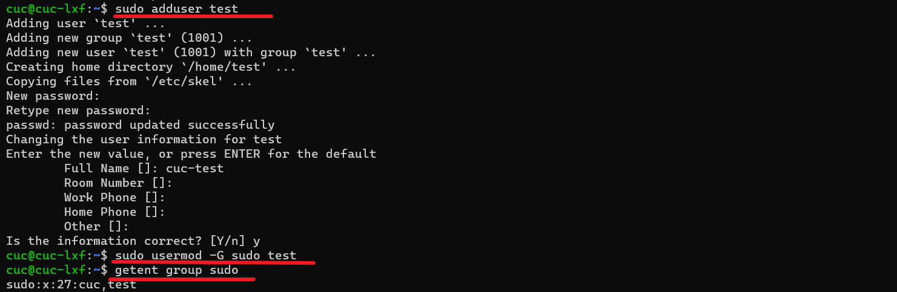

##### 如何将一个用户添加到一个用户组？

```bash
#新建用户组test
sudo addgroup testgroup

#查看test用户当前组
groups test

#将test用户添加到testgroup
sudo usermod -a -G testgroup test

#查看test用户已加入的组别，显示添加成功
groups test
```

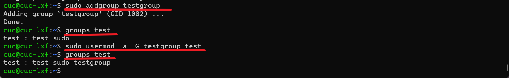

##### 如何查看当前系统的分区表和文件系统详细信息？

```bash
#查看分区表
sudo fdisk -l 

#查看文件系统详细信息 
df -h
```

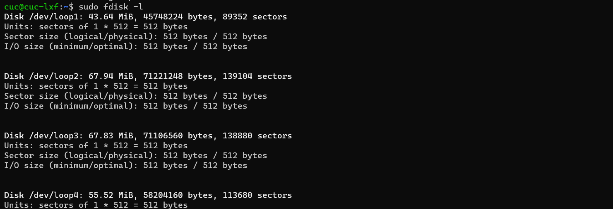

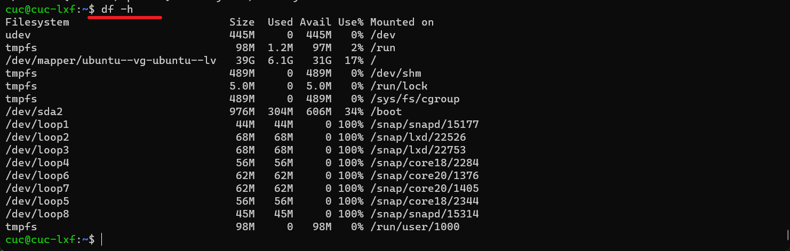

##### 如何实现开机自动挂载Virtualbox的共享目录分区？

1. 在宿主机新建共享文件夹`mysharefile`，我的路径为(C:\Users\ASUS\Documents\mysharefile)

2. 在 VirtualBox 中添加共享文件夹

   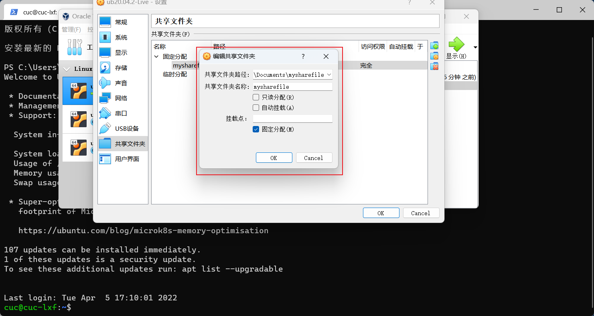

3. 在虚拟机上的/mnt目录下新建一个共享文件的挂载目录，并实现挂载

   ```bash
   # 创建共享目录
   $ sudo mkdir /mnt/share
   
   # 实现挂载
   $ sudo mount -t vboxsf share_cynthia /mnt/share/
   
   # 再次进入  /mnt/share  目录下就可以查看共享文件夹内的文件
   $ cd /mnt/share
   
   #可以看到宿主机中共享文件夹中的文件
   $ ls
   ```
   
   
   
3. 通过修改`fstab`文件实现开机自动挂载共享文件夹

   ```bash
   # 用 sudo 方式用 vim 打开并修改 '/etc/fstab' 文件
   $ sudo vim /etc/fstab
   
   # 在文件最后添加以下语句
   $ mysharefile /mnt/share/ vboxsf default 0  0
   ```
   
   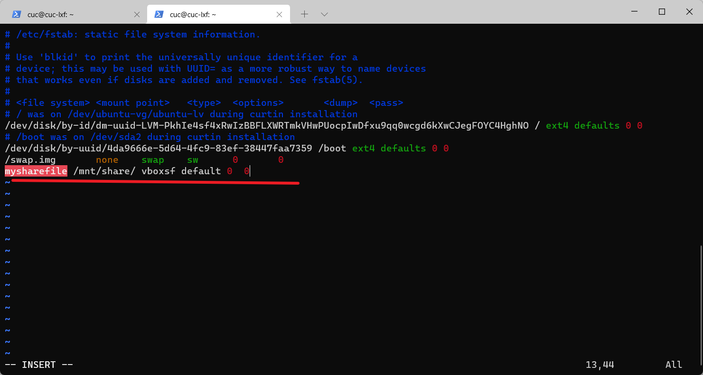
   
3. 查看是否成功

   ```bash
   # 查看是否成功
   $ df -h
   ```
   
   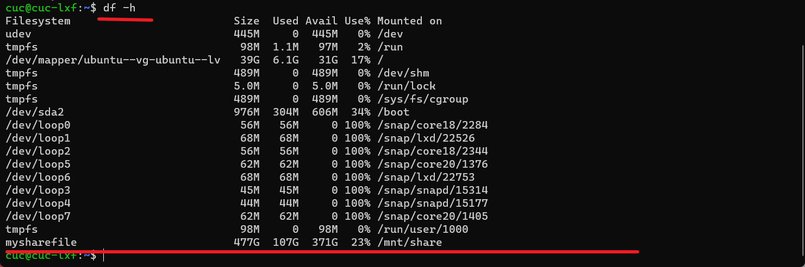

##### 基于LVM（逻辑分卷管理）的分区如何实现动态扩容和缩减容量？

1. 先准备好物理硬盘，并创建分区

   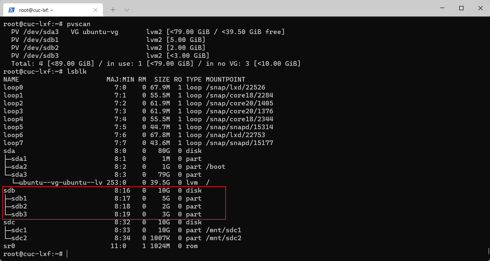

2. 在物理分区上创建 PV

   ```bash
   # PV 管理阶段
   # 在物理分区上创建 PV
   pvcreate {{/dev/sdX1}}
   
   # 查看所有可用 PV
   pvs
   pvscan
   ```

   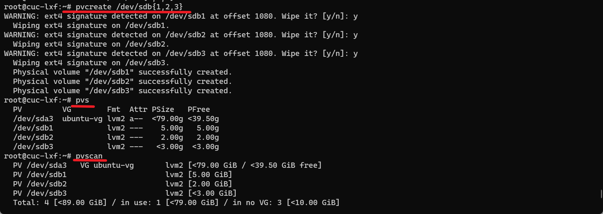

3. 在物理分区上创建 PV

   ```bash
   # VG 管理阶段
   # 创建 VG
   # 以下例子将 3 个物理分区加入到一个名为 ubuntu-vg1 的 VG
   vgcreate ubuntu-vg1 /dev/sdb{1,2}
   
   # 查看 VG 详细信息
   vgdisplay
   ```

   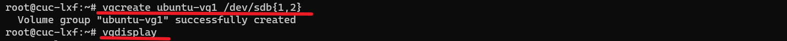

4. 在 VG 上创建虚拟分区 LV

   ```bash
   # LV 阶段
   # -L 指定分区大小，-n 指定逻辑分区名称
   lvcreate -L 3G -n lv1 ubuntu-vg1
   lvcreate -L 2G -n lv2 ubuntu-vg1
   lvcreate -l 100%FREE -n lv3 ubuntu-vg1
   
   # 查看 LV 详细信息
   lvdisplay
   ```

   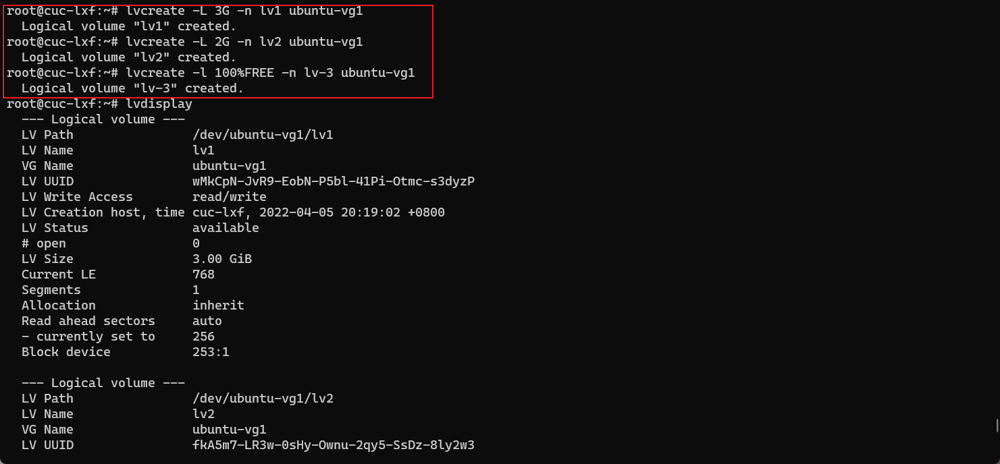

5. 实现动态扩容和缩减容量

   ```bash
   # 扩容
   lvextend -L +1G /dev/ubuntu-vg1/lv1
   
   # 减容
   lvreduce -L -1G /dev/ubuntu-vg1/lv1
   ```

   

##### 如何通过 systemd 设置实现在网络连通时运行一个指定脚本，在网络断开时运行另一个脚本？

1. 进入 systemd 放置 service 的目录，在该目录创建一个新的 .service 文件用于配置开机启动脚本,并运行脚本

   ```bash
   # 创建服务配置文件
   sudo touch /etc/systemd/system/test.service
   
   #设置[Unit]Requires=，After=字段，使新配置文件依赖网络运行不同脚本
   # 以下为 test.service 配置文件的内容
   [Unit]
   Description=This is a linux test.
   Requires=network-online.target
   After=network.target
   
   [Service]
   ExecStart=/bin/echo network-on >> /home/cuc/log 
   ExecStop=/bin/echo network-on >> /home/cuc/log 
   
   [Install]
   WantedBy=multi-user.target
   
   # 手动运行test.service
   $ systemctl start test.service
   
   # 查看状态
   $ systemctl status test.service
   ```

   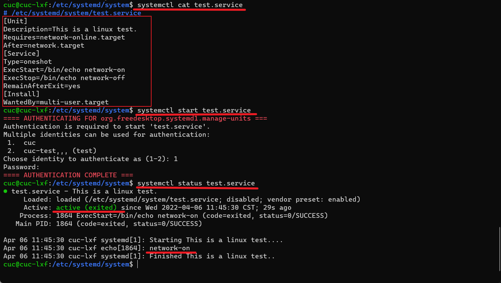

2. 重载后运行`test.service`

3. 不知为何提示 Active: inactive (dead)，也就是服务 disabled。我再研究一下……

##### 如何通过 systemd 设置实现一个脚本在任何情况下被杀死之后会立即重新启动,实现''杀不死''?

1. 修改配置文件[service]区块，将`restart`设置为`always`

   ```bash
   [Service]
   Restart = always
   ```

2. 重新加载配置文件`sudo systemctl daemon-reload`

3. 重新启动服务`sudo systemctl restart [servicename]`

------

## 实验总结

- 原文档中`httpd.service`一直都无法运行，所以我就换成了`apache.service`，但其实后面查阅官方文档和某些资料的时候，发现可以说`httpd.service`跟`apache.service`好像是一个东西。

- 操作命令`systemctl status bluetooth.service`时发现报错，查看了一下，系统里面没有这个服务，可能跟虚拟机环境有关系吧。

- `timedatectl`设置当前时区时发现报错，我查看了同学们的讨论，发现还是有问题。

  

  通过网上[查阅资料](https://www.linuxhelp.com/questions/failed-to-set-time-automatic-time-synchronization-is-enabled)，发现需要把系统同步关掉才能自己设置时间

  ```bash
  timedatectl set-ntp 0
  ```

- systemd 设置实现脚本运行所示，出现了无法运行的情况。


## 参考链接

- [Systemd 入门教程：命令篇 by 阮一峰的网络日志](http://www.ruanyifeng.com/blog/2016/03/systemd-tutorial-commands.html)
- [Systemd 入门教程：实战篇 by 阮一峰的网络日志](http://www.ruanyifeng.com/blog/2016/03/systemd-tutorial-part-two.html)
- [第三章：Linux服务器系统管理基础](https://c4pr1c3.github.io/LinuxSysAdmin/chap0x03.md.html#/title-slide)
- [最新cenos执行service httpd restart 报错Failed to restart httpd.service: Unit not found.](https://www.shuzhiduo.com/A/GBJrwMr950/)
- [走进Linux之systemd启动过程](https://blog.csdn.net/YuZhiHui_No1/article/details/52228763)
- [apache2](https://httpd.apache.org/)
- [Apache HTTP Server](https://en.wikipedia.org/wiki/Apache_HTTP_Server)
- [Failed to set time: Automatic time synchronization is enabled](https://www.linuxhelp.com/questions/failed-to-set-time-automatic-time-synchronization-is-enabled)
- [systemd.service 中文手册](http://www.jinbuguo.com/systemd/systemd.service.html)
