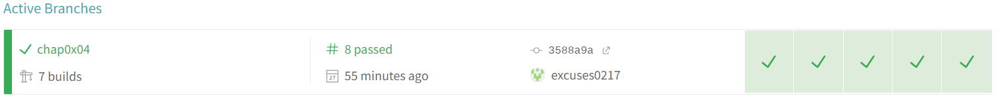

# 第四章：shell脚本编程基础（实验）

## 实验环境

- Ubuntu 20.04.2 LTS（VirtualBox 虚拟机）
- Windows 11 (本机)
- Travis CI 持续集成服务环境

------

## 实验任务

##### 任务一：用bash编写一个图片批处理脚本，实现以下功能：

- [x] 支持命令行参数方式使用不同功能
- [x] 支持对指定目录下所有支持格式的图片文件进行批处理
- [x] 支持以下常见图片批处理功能的单独使用或组合使用
  - [x] 支持对jpeg格式图片进行图片质量压缩
  - [x] 支持对jpeg/png/svg格式图片在保持原始宽高比的前提下压缩分辨率
  - [x] 支持对图片批量添加自定义文本水印
  - [x] 支持批量重命名（统一添加文件名前缀或后缀，不影响原始文件扩展名）
  - [x] 支持将png/svg图片统一转换为jpg格式图片

[processimage.sh](./code/processimage.sh)

##### 任务二：用bash编写一个文本批处理脚本，对以下附件分别进行批量处理完成相应的数据统计任务：

[2014世界杯运动员数据](https://c4pr1c3.github.io/LinuxSysAdmin/exp/chap0x04/worldcupplayerinfo.tsv)

- [x] 统计不同年龄区间范围（20岁以下、[20-30]、30岁以上）的球员**数量**、**百分比**
- [x] 统计不同场上位置的球员**数量**、**百分比**
- [x] 名字最长的球员是谁？名字最短的球员是谁？
- [x] 年龄最大的球员是谁？年龄最小的球员是谁？

[world_cup_statistic.sh](./code/world_cup_statistic.sh)

[任务二数据](./task_report/Task2Data.md)

##### 任务三：用bash编写一个文本批处理脚本，对以下附件分别进行批量处理完成相应的数据统计任务：

[Web服务器访问日志](https://c4pr1c3.github.io/LinuxSysAdmin/exp/chap0x04/web_log.tsv.7z)

- [x] 统计访问来源主机TOP 100和分别对应出现的总次数
- [x] 统计访问来源主机TOP 100 IP和分别对应出现的总次数
- [x] 统计最频繁被访问的URL TOP 100
- [x] 统计不同响应状态码的出现次数和对应百分比
- [x] 分别统计不同4XX状态码对应的TOP 10 URL和对应出现的总次数
- [x] 给定URL输出TOP 100访问来源主机

[weblog.sh](./code/weblog.sh)

[任务三数据](./task_report/Task3Data.md)

##### 练习：求两个整数的最大公因数

[maximum_common_factor.sh](./code/maximum_common_factor.sh)

以上实验均在Travis CI 持续集成服务环境中验证通过

------

### 参考链接

- [EddieXu 同学的仓库 2021-linux-public-kal1x](https://github.com/CUCCS/2021-linux-public-kal1x/tree/chap0x04)
- [Linux系统与网络管理 黄玮](https://c4pr1c3.github.io/LinuxSysAdmin/chap0x04.md.html#/title-slide)
- [Shell 教程](https://www.runoob.com/linux/linux-shell.html)
- [Bash Shell编程入门](https://www.jianshu.com/p/e1c8e5bfa45e)
- [AWK command in Unix/Linux with examples](https://www.geeksforgeeks.org/awk-command-unixlinux-examples/)

